> Developed for [Google Summer of Code 2026](https://summerofcode.withgoogle.com/) under the DeepForest project (WeeCology).

# Recovering Bird Annotations from Historical Airborne Imagery

Between 2010 and 2021, surveyors counted birds in Gulf of Mexico aerial photographs using a point-counting tool. The tool drew a coloured dot on the photograph for every bird and saved a screenshot. It never saved the coordinates. What remains is 18,304 screenshots with the annotations baked into the pixels, and the clean high-resolution photographs they were drawn on.

This project reads the dots back out. It finds each dot, works out which class it belongs to, and maps it onto the original photograph as DeepForest training data.


Left: the screenshot, with the counting tool's dots and its dialog drawn over the photograph. Right: the same photograph, clean. Everything the pipeline needs is on the left, including the legend that says what each marker means.

Data source: `twi-aviandata.s3.amazonaws.com` (Gulf of Mexico avian monitoring, post-Deepwater Horizon).

## Status

The pipeline runs from the images alone. Survey counts are never an input; the CSV is used only to check the output.

| | Measured | On |
|---|---|---|
| Registration success | **96.7%**, 0.38px median reprojection error | 60 pairs |
| Detection precision, on frames the pipeline accepts | **0.30–1.00** per frame | 7 hand-labelled frames |
| Dot placement error | **0.65px** median | 1,648 hand-labelled dots |
| Classification, per dot | **0.781** | 885 matched dots, 7 frames |
| Tests | **211** passing, CI on Python 3.10 and 3.11 | |

**Detection is finished.** The important part is not a single accuracy figure. It is that every image now carries a check on whether its detections can be trusted, before anything is built from them.

A frame that reports far more dots than the image contains cannot be accurate, whatever is done downstream. That check needs no labels and no survey data, so it runs on every image. Pass rates were measured on the 63-pair benchmark and applied to the band distribution of all **18,252 screenshots**: about **48% of images pass, and they hold roughly 72% of the corpus's dots around 2 million annotations.** That is far more than training a DeepForest model needs, so the recovered set is large enough for the next stage to begin. See [Choosing frames](#choosing-frames).

Both stages are scored against **hand-labelled dot positions**, not counts. The survey gives a count per image and never a coordinate, so until those labels existed there was no way to tell a pipeline that found the right dots from one that found the right *number* of dots in the wrong places. 1,648 dots across 12 frames are labelled in `data/labels/` and scored by `scripts/eval_localisation.py`.

The classification figure quotes seven of those twelve: the frames that both pass the check above and carry a class per dot. Quoting all twelve would mix in five frames the pipeline rejects, which measures a configuration nobody runs.

Mapping the dots onto the original photograph and exporting the DeepForest CSV are next. Those two steps are what turn the recovered dots into deliverable #2.

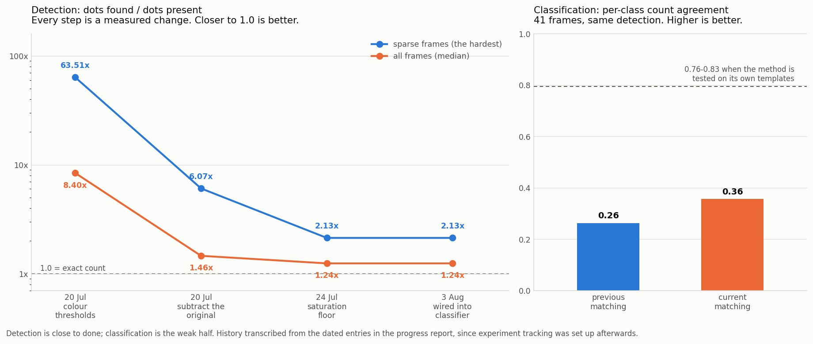

Each point on the left is a measured change, not a re-tuning. Sparse frames were the worst case throughout: 63.51× over-detection under colour thresholds, 6.07× once the clean original was subtracted, 2.13× after the saturation floor. The dashed line on the right is what the same matching scores when it is tested against templates cut from its own pixels, which is why both numbers are reported.

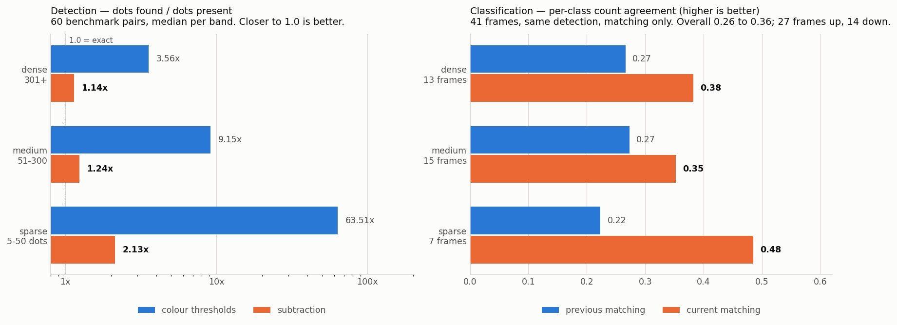

Left: every frame sits under the ceiling its reported count implies, and the ones near 1× sit close to it. Right: the same frames ordered by that ratio, showing recall holding steady while precision splits. Both panels are drawn from `results/eval_localisation.csv` by `scripts/make_improvement_figure.py`, so they cannot fall behind the code.

## What the data looks like

Two weeks went into measuring the data before any pipeline code existed: 533K files mapped in the S3 bucket, 49,204 CSV rows across 60 columns analysed, 25 images downloaded and measured by hand.


Laughing Gull is the most common species at 855K birds, not Brown Pelican. The median image holds 61 birds and 65% hold fewer than 100, so the four large study images used early on were never representative. 18 annotators, 7 years, 5 Gulf Coast states.


Measured from 1,199 dots: median diameter 8.0px, circularity 0.57, six distinct colours. Circularity of 0.57 is what makes shape matching hard, because a dot at this size is barely a shape at all. These measurements set the colour-path thresholds and the template size.

## How it works

Every screenshot raises two separate questions, handled by different modules.

| Question | Modules |
|---|---|
| Where are the dots, and how many? | `align.py` → `subtract.py` |
| Which class is each dot? | `legend.py` → `classify.py` |

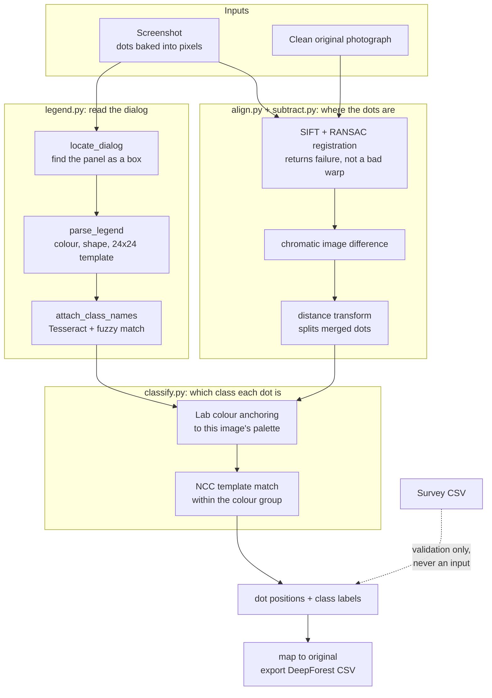

### Reading the dialog

The counting tool leaves a floating panel somewhere in the frame listing every class, its marker and its count. `locate_dialog` finds that panel as a box, wherever it sits, and everything outside it stays aerial.

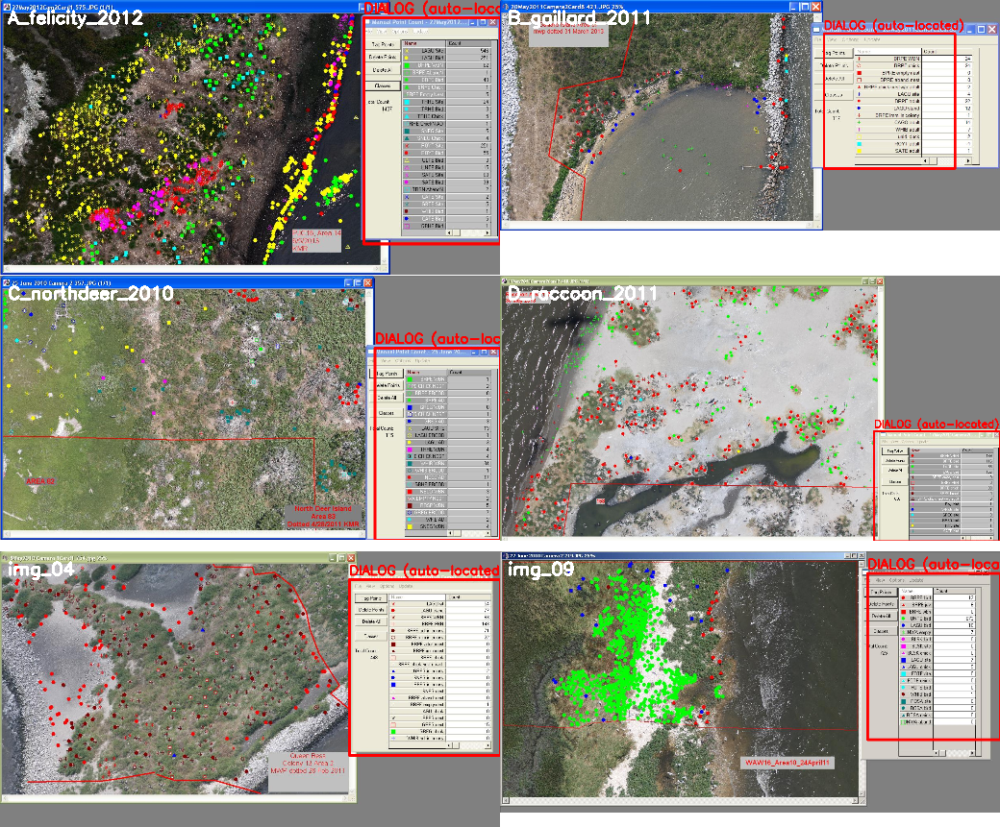

Marker to class is a **per-image** mapping, not a global one, so the pipeline parses each dialog separately and cuts a 24×24 template from each row's own glyph.

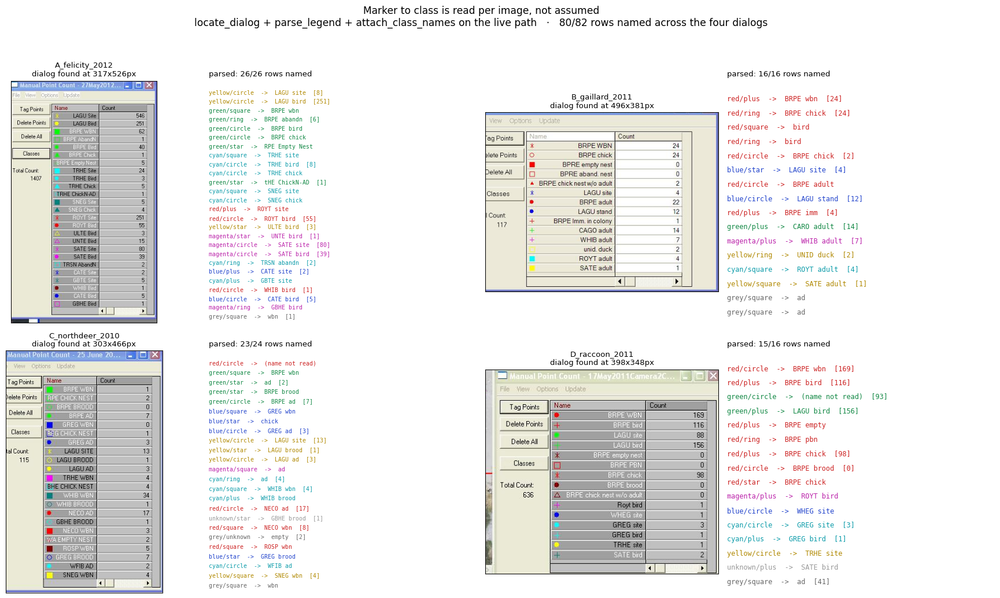

Compare the four dialogs and the reason is plain: a red plus means BRPE wbn in image B and BRPE bird in image D, and a circle means "site" in one image and "chick" in another. A global shape dictionary would get these wrong. Tesseract reads the class names, fuzzy-matched against the 98 species codes, which resolves 80 of the 82 rows shown. Regenerate with `python scripts/make_legend_figure.py`.

### Finding the dots

The clean original still exists, so a dot is whatever is present in the screenshot and absent from the photograph. `align.py` registers the two with SIFT and RANSAC, and returns a refusal instead of a bad warp when the match is poor. `subtract.py` takes the difference.

A colour threshold tests something different: whether a pixel falls inside a fixed band. Leaves, water glints and red map labels fall inside it too.

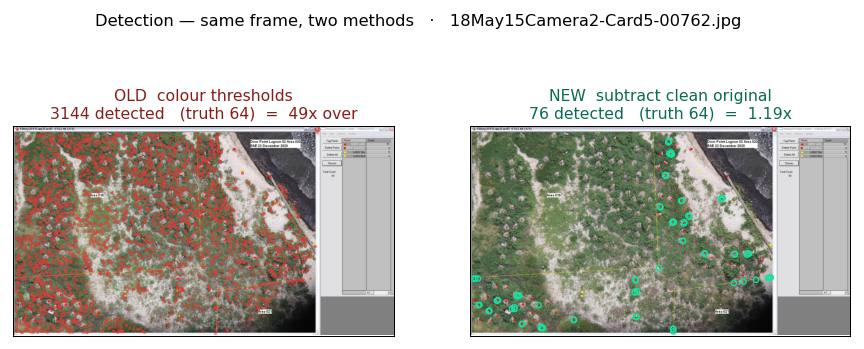

Dense colonies are the hardest case. Overlapping dots merge into a single blob, so a distance transform splits that blob back into individual markers.

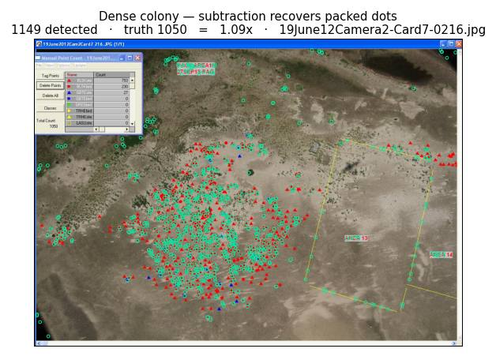

Measured against hand-labelled dot positions, on the seven accepted frames that carry labels:

| frame | dots labelled | precision | recall |
|---|---|---|---|
| `18May15…00825` | 10 | **1.00** | 1.00 |
| `17May10…5745` | 372 | **0.76** | 0.79 |
| `18June21…06389` | 103 | **0.74** | 0.53 |
| `19May18…00620` | 178 | **0.72** | 0.74 |
| `18May11…0027` | 335 | 0.46 | 0.63 |
| `18May15…426` | 193 | 0.42 | 0.51 |
| `27May12…0449` | 215 | 0.30 | 0.40 |

Median placement error is **0.65px** across all of them. Placement holds everywhere; what changes between frames is how much of the surroundings is detected alongside the markers.

Most of that loss is map ink. On `0027` a painted transect line runs the width of the frame and is detected along its length, and on `06389` the painted words "Rabbit Area" are detected as markers. Both are drawn in the same palette colours as the dots, so colour cannot separate them. Geometry could: a line is collinear and text is a regular run of characters. That is written up in [what did not work](#what-did-not-work), because the one filter tried for it removed real birds.

### Choosing frames

Not every image is worth using, and which ones can be worked out from the image alone.

The check is arithmetic, and it lives in `src/select.py`. Correct detections can never outnumber the dots actually on the image, so precision is capped at `dots present / dots reported`. A frame reporting seven times what it should hold cannot exceed 14% precision, however it is filtered afterwards. Nothing about that needs labels.

The band has to be two-sided. Under-detection is equally disqualifying, and a frame returning a single detection for 19 dots passed a one-sided cut while being useless. One quality target sets both edges: `q ≤ ratio ≤ 1/q`, with `q = 0.6`.

Verified against hand labels on three frames spanning two density bands and 10 to 186 dots:

| ratio reported / present | precision |
|---|---|
| 1.00 | **1.00** |
| 0.99 | **0.82** |
| 0.62 | **0.74** |
| 5.63 | 0.14 |
| 7.35 | 0.07 |
| 14.22 | 0.04 |

Applying the benchmark's per-band pass rates to the band distribution of all 18,252 screenshots: **about 48% of images pass, holding roughly 72% of the corpus's dots.**

Frames that fail are mostly sparse scenes over textured ground. A mangrove colony with nine real markers returned 128 detections, because at this resolution a leaf and a marker are the same handful of pixels. Five ways of filtering those out were measured and none separated them; that is written up in [what did not work](#what-did-not-work). Excluding those frames costs little, because sparse images hold only 6% of the corpus's dots.

### Assigning classes

`classify.py` has to separate classes that share a colour, such as BRPE nest, bird and chick, all drawn in red. **The class identity is the legend row, not the name read off it** — one dialog carries two rows that both OCR as `ad`, and keying on the name merges them.

Four steps decide where a dot goes.

**Colour picks the candidate rows**, using the palette that image's own dialog uses, in Lab space. A legend glyph is drawn crisply on a white table cell; the same marker in the aerial is a few pixels of thin stroke over vegetation at a quarter of the resolution, so its measured colour drifts. That drift is corrected **per row, not per frame**. On `5745` the frame-wide median difference is `a = −12.5` while row 0 needs `−29.4` and row 2 needs `−11.0`. The glyph explains it: a thin asterisk mixes with whatever it sits on, where a filled circle keeps its own colour. On `00620` two rows of the same species and the same colour need `L = −84` and `L = −16`.

**A template match ranks them.** Normalised cross-correlation against the 24×24 template cut from each candidate row, with colour agreement folded into the score, so a dot sitting on a row's colour outranks one that barely reached the margin.

**Each row is limited to the Count the dialog states.** A dot whose best row is full goes to its next best row instead; a dot with no candidate row left is scored again against every row that still has space. Without this, populous `site` rows stay half empty while empty `bird` rows fill up, which is a label swap that per-class counts cannot see.

**A dot matching no row keeps no class.** That is the valid/invalid split Josh asked about, and the pipeline already makes it.

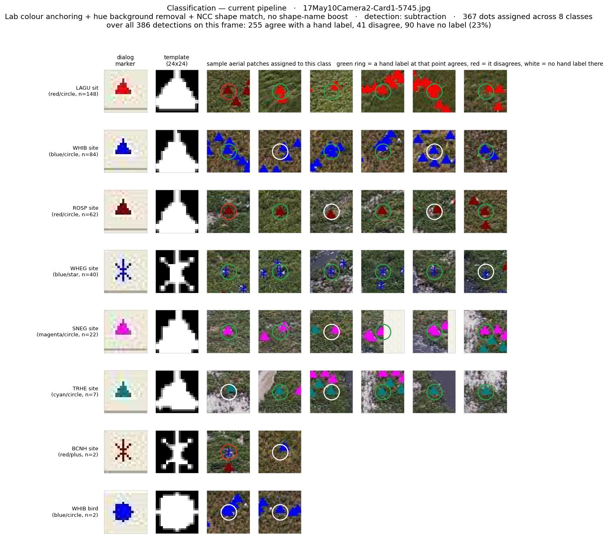

Each row shows the dialog's own marker, the template cut from it, and six aerial patches drawn at random from everything assigned to that class. `scripts/make_classify_figure.py` generates it from the live pipeline, so it always shows current behaviour, and the title strip records which detection path ran.

The rings carry the verdict. Green means a hand label at that point agrees with the class the pipeline gave; red means it disagrees; white means no label sits there. **White is not evidence of an error.** Hand labelling is not exhaustive — 90 of this frame's 386 detections have no label — so an unringed patch is unverified rather than wrong.

Read that way, the figure says two things at once. The populous rows are right: `WHIB site` at 84 dots and `WHEG site` at 40 are green almost throughout, and the white rings among them sit on markers identical to the green ones. The two rows holding two dots each are wrong on every dot, and **both of them match the dialog's stated count exactly**. That is the clearest argument in the repository for why counts prove nothing about labels.

The whole frame, with every detected dot drawn in the colour of the class it was given, beside what the dialog states, what the pipeline assigned, and what the labels say:

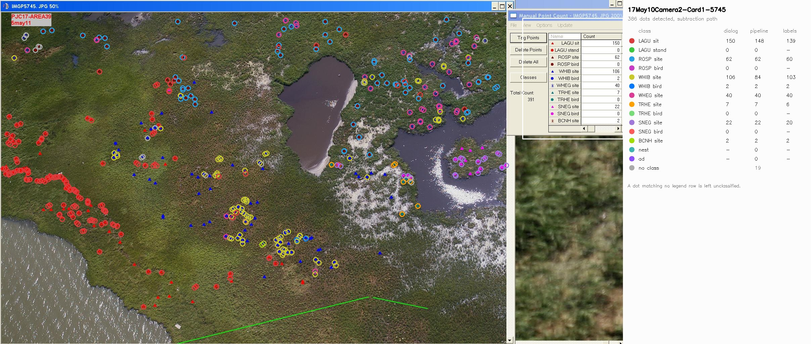

`LAGU sit` reads 150 in the dialog, 148 from the pipeline and 139 by hand; `ROSP site` 62, 62 and 60; `WHEG site` 40, 40 and 40. The 19 dots with no class are mostly ink that is not a marker.

Per-dot accuracy, on the seven frames that both pass frame selection and carry a class per dot:

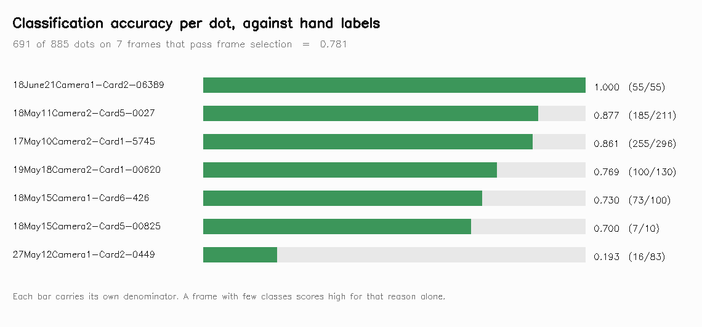

**0.781 over 885 dots.** Dropping `0449`, where the dialog's counts are misread, gives 0.842. `06389` reads 1.000 because it has two classes, which is worth saying rather than quoting.

One older measurement is kept here so neither is mistaken for the other. **Legend self-recovery scores 76–83%**: a legend glyph is shrunk to aerial scale and pushed back through matching to see whether it recovers its own class. That flatters the method, because the template and the test glyph come from the same pixels. The gap to 0.781 is how much of it comes from testing the method against itself.

## The benchmark

An earlier four-image set was small enough to overfit, and it used the wrong ground truth. Reading the counting tool's own *Total Count* field settled which column is correct: the dot count is `category_sum`, the sum of the per-class columns, not `total_birds`. `total_birds` excludes chicks and undercounts by up to 57%.

The current benchmark is **63 stratified pairs**: 7 years × 3 density bands × 3 images, across 40 colonies, with dot counts from 7 to 2,037. Density band means the number of annotation dots on the image, not the number of colours: sparse is 5–50, medium 51–300, dense 301 and above. Sampling by band keeps the dense tail in, because that is where detection was always weakest. Detection and alignment are scored on the 60 of those 63 whose screenshot and original are both cached locally.

### The ground truth needs checking too

One dense frame looked like a bad regression, 450 dots down to 9. Opening it showed why.

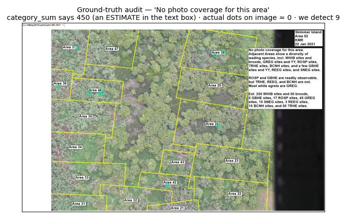

It is a "No photo coverage for this area" frame. There are no dots on it at all, only survey polygons and a text box. Its `category_sum` of 450 is a written estimate. The old detector scored 288 by counting polygon lines.

## Limitations

- **The Count column is read from the wrong place on 14 of the 25 frames.** `attach_class_names` takes the second table gridline as the Name|Count divider. On `0449` the gridlines are `[8, 110, 195, 315]` and the marker sits at x=122, so that second line falls to the *left* of the marker and the strip read as the Count column is really the Name column. The dialog plainly reads 93, 70, 11, 23, 10 and the parser returns 3, None, 0, 0, 0. A misread `0` does more damage than no count, because zero blocks a row entirely: 66 of that frame's 83 labelled dots end up unassigned and it scores 0.193 against 0.781 pooled. Two attempts to fix it both broke classification and both were reverted, which is written up in [what did not work](#what-did-not-work).
- **A class holding only a handful of dots is unreliable.** On `5745` the two rows with two dots each are wrong on every dot, while the rows with 40 and more are right almost throughout.
- **Map ink is detected as markers.** Painted transect lines and area labels use the same palette colours as the dots. On `0027` this costs about half the precision.
- **Only 4 of the 25 frames reaching classification had labels until recently**, and 21 still have none. What can be checked on the rest is a per-species tally against the survey manifest, which the pipeline never reads. That check ranks frames correctly but reads high: it predicted 1.000, 0.995 and 0.403 for three frames that then measured 0.877, 0.730 and 0.193 by hand.
- **The accepted set skews dense** — 89% of dense frames pass the check against 28% of sparse. A training set built from it will see more crowded scenes than empty ones, and species that only appear on sparse frames will be under-represented.
- **Three of the 28 frames with a dialog have the box in the wrong place**, and they are excluded by name. Six automatic tests were measured to separate them and every one overlaps.

## Repository structure

```
src/legend.py       find the dialog, parse each row to marker, colour, shape, template, class, count
src/align.py        register the clean original onto the screenshot
src/subtract.py     annotations as image difference; turn ink into dot candidates
src/select.py       which frames to trust, from the reported-to-detected ratio alone
src/classify.py     Lab colour anchoring per row, NCC shape matching, capacity per class
scripts/            benchmark builders, evaluation harnesses, figure generators
tests/              211 tests
data/labels/        1,648 hand-labelled dots across 12 frames
notebook/           the earlier Colab prototype, stages 3 to 7
docs/learnings.md   what went wrong and why
```

`src/decompose.py` and `src/detect.py` are kept for reference and are not part of the live pipeline. `decompose.py` split each screenshot at roughly half its width, which discarded much of the aerial and the birds in it; `legend.locate_dialog` replaced it. `detect.py` needs CSV counts as an input, which breaks the rule that the pipeline works from the image alone.

## Quick start

```bash
pip install -r requirements.txt          # full
pip install pytest numpy opencv-python scikit-image PyYAML scipy   # tests only

pytest tests/ -q                         # 211 passing

python scripts/build_manifest.py         # survey counts, ~1.4 MB
python scripts/build_benchmark.py --per-cell 3   # the 63 pairs, ~472 MB
python scripts/eval_localisation.py      # per-dot precision, recall, placement, class
python scripts/eval_alignment.py         # registration success rate
```

`eval_localisation.py` is the gate. `eval_detection.py` compares counts, and a count
cannot see whether a dot sits on a marker.

To redraw the figures in this file:

```bash
python scripts/make_classification_figures.py
python scripts/make_classify_figure.py --pair 17May10Camera2-Card1-5745.jpg --rows 8
```

The tests need no data and no network; the fixtures they use are in the repo. Everything below `pytest` downloads from a public bucket, so no credentials are involved, but the pairs are large because the clean originals are about 7 MB each. `build_benchmark.py --dry-run` prints the selection and the download size without fetching anything. Both scripts cache, so an interrupted run can be repeated.

Class-name OCR needs the Tesseract binary, not just `pytesseract`. On Windows: `winget install UB-Mannheim.TesseractOCR`. The pipeline skips OCR and keeps parsing if Tesseract is missing.

All tunable parameters live in `config.yaml`.

## About this work

Built with guidance from the DeepForest maintainers and past contributors, who walked me through the open-source contribution process as well as the research. Before writing pipeline code I spent two weeks studying the data, and I would do that again: roughly 40% of the time on this project has been measurement rather than building, and almost every parameter in `config.yaml` traces back to something measured rather than guessed.

The pipeline has been through several detector versions, four training experiments, and a number of approaches I tested and dropped. I wrote up each dropped approach with its root cause, which turned out to matter: two of them had been abandoned for the wrong reason. OCR is the clearest case. I rejected it at 4% precision, but that test ran on a fixture 2.3× smaller than a real screenshot, and at full resolution it works.

The lesson I keep relearning is to check what is actually being measured before trusting the number. Detection was scored against the wrong CSV column for weeks, and the four-image test set was small enough that tuning against it looked like progress.

## The earlier prototype

`notebook/prototype_v1.ipynb` is a 23-section prototype that runs in Colab on a T4 GPU in about 45 minutes. Stages 3 to 7 still live there and have not yet been rewritten as modules: coordinate mapping, SAM 3 validation, DeepForest training and export.


Stage 4 is the one that matters next: dots read off the screenshot, placed onto the clean original. SIFT homography puts them within about 0.5px; the height-ratio fallback used when SIFT fails is roughly 30px out, and that error is what limited training.

Its numbers were measured differently from the ones above and are not comparable. Detection there was scored at 70.8% on 30 random images, against `total_birds` and using CSV counts as a pipeline input. Both of those are now known to be wrong: `total_birds` is the wrong column, and feeding the pipeline the answer it is meant to produce is not a fair test. The 63-pair benchmark replaced it.

What the prototype did establish still holds. Training on 920 SIFT-mapped annotations at 0.5px accuracy improved on pretrained DeepForest by 29% in max score, while training on all 3,851 annotations including entries with about 30px position error made the model worse. Position accuracy matters more than the amount of data, which is why registration quality is gated rather than assumed.

Details: [docs/training_analysis.md](docs/training_analysis.md).

## What did not work

| Approach | Result |
|---|---|
| Narrow HSV colour bins | 44% detection; dots vary more than expected |
| Text watermark filter | Removed real birds; colony rows look like text |
| Uniform `scale_x` for mapping | 23–39% horizontal stretch; use `scale_y` for both axes |
| Species-aware box sizes | Worse, because positions were the real problem |
| Training on the full dataset | 0 high-confidence detections |
| Colour filtering during detection | Cut one sparse frame from 129 detections to 1, against a true count of 9 |

Five more were measured against the hand labels, trying to separate real markers from background on the frames that over-detect. None of them worked, and they are recorded so the ground is not covered twice:

| Approach | Result |
|---|---|
| Raise the saturation floor | False positives are *more* saturated than true ones, 204 against 178. Moving the floor from 60 to 140 left precision flat at 0.29 and discarded 30% of the real markers. |
| Minimum blob area | The direction reverses between frames — real markers are larger on three, smaller on two. |
| Elongation | Real and false medians are both 1.00 on five frames of six. |
| Legend template match score | Reversed on one frame, where false positives scored 1.000 and real markers 0.218. |
| A learned filter over all four | Logistic regression with leave-one-frame-out validation gained 0.012 F1 while recall fell from 0.597 to 0.177. Its raw and per-frame-normalised weights take opposite signs, which is what a feature carrying no consistent signal looks like. |

The conclusion is that these frames cannot be cleaned by filtering what has already been detected, which is why the pipeline excludes them instead.

Five more were measured while building the classification stage:

| Approach | Result |
|---|---|
| Read the dialog's own **Total Count** and use it as a budget | Correct on 11 of 25 frames, absent on 8, OCR noise on 6. Where it reads it is accurate, and 11 of 25 is too thin to cap classes with. |
| Give **every** row with an unreadable count a capacity of zero | Recovers the frame it was built for and destroys frames whose Count column barely reads. One went from 0.516 to 0.065. Only rows parsed *below* the last counted row are safe to zero. |
| Discard a per-row colour offset that looks contaminated by a neighbouring row | Saved one dot on one frame and cost six on another. Pooled 0.789 to 0.779. A wrong offset only ever adds a candidate, and the template score handles it. |
| Let the species matcher accept two edits instead of one | `nest` becomes the species code `BNST`. Coverage bought with a wrong species is a regression. |
| Take the Name\|Count divider from the first gridline right of the marker | The geometry is right and the fix broke classification twice, 0.861 to 0.634 and 0.861 to 0.600. Moving the name boundary changes the parsed `class_name`, and row identity is keyed on that. It is a classification change wearing a legend-parsing disguise, and it has to be scored on `eval_localisation.py` rather than on name coverage. |

Full list: [docs/learnings.md](docs/learnings.md).
