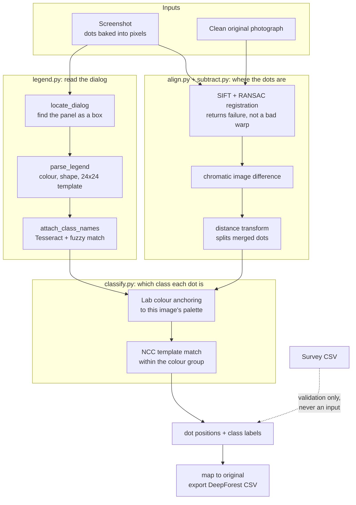
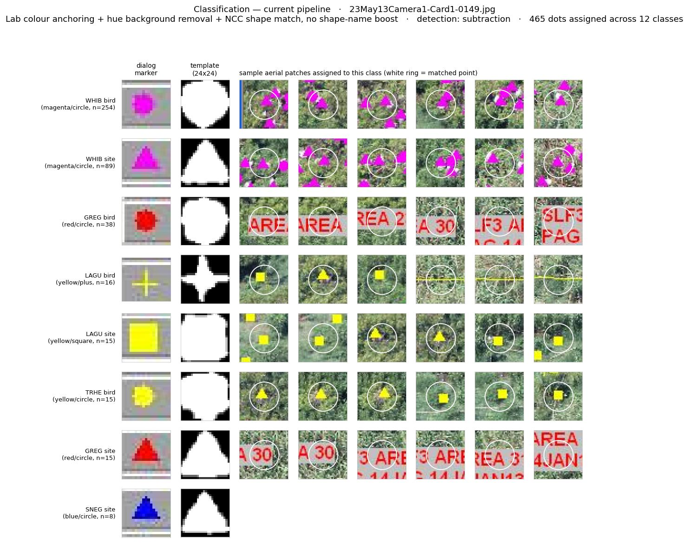

> Developed for [Google Summer of Code 2026](https://summerofcode.withgoogle.com/) under the DeepForest project (WeeCology).

# Recovering Bird Annotations from Historical Airborne Imagery

Between 2010 and 2021, surveyors counted birds in Gulf of Mexico aerial photographs using a point-counting tool. The tool drew a coloured dot on the photograph for every bird and saved a screenshot. It never saved the coordinates. What remains is 18,304 screenshots with the annotations baked into the pixels, and the clean high-resolution photographs they were drawn on.

This project reads the dots back out. It finds each dot, works out which class it belongs to, and maps it onto the original photograph as DeepForest training data.


Left: the screenshot, with the counting tool's dots and its dialog drawn over the photograph. Right: the same photograph, clean. Everything the pipeline needs is on the left, including the legend that says what each marker means.

Data source: `twi-aviandata.s3.amazonaws.com` (Gulf of Mexico avian monitoring, post-Deepwater Horizon).

## Status

The pipeline runs from the images alone. Survey counts are never an input; the CSV is used only to check the output.

| | Measured | On |
|---|---|---|
| Registration success | **96.7%**, 0.38px median reprojection error | 60 pairs |
| Detection error | **1.24×** median dots found / dots present | 60 pairs |
| Classification agreement | **0.36** per-class count agreement | 41 frames |
| Tests | **166** passing, CI on Python 3.10 and 3.11 | |

Detection is close to finished. Classification works but is still weak, and that is the current focus.


## What the data looks like

Two weeks went into measuring the data before any pipeline code existed: 533K files mapped in the S3 bucket, 49,204 CSV rows across 60 columns analysed, 25 images downloaded and measured by hand.


Laughing Gull is the most common species at 855K birds, not Brown Pelican. The median image holds 61 birds and 65% hold fewer than 100, so the four large study images used early on were never representative. 18 annotators, 7 years, 5 Gulf Coast states.


Measured from 1,199 dots: median diameter 8.0px, circularity 0.57, six distinct colours. Circularity of 0.57 is what makes shape matching hard, because a dot at this size is barely a shape at all. These measurements set the colour-path thresholds and the template size.

## How it works

Every screenshot raises two separate questions, handled by different modules.

| Question | Modules |
|---|---|
| Where are the dots, and how many? | `align.py` → `subtract.py` |
| Which class is each dot? | `legend.py` → `classify.py` |



### Reading the dialog

The counting tool leaves a floating panel somewhere in the frame listing every class, its marker and its count. `locate_dialog` finds that panel as a box, wherever it sits, and everything outside it stays aerial.


Marker to class is a **per-image** mapping, not a global one, so the pipeline parses each dialog separately and cuts a 24×24 template from each row's own glyph.


Compare the four dialogs and the reason is plain: a red plus means BRPE wbn in image B and BRPE bird in image D, and a circle means "site" in one image and "chick" in another. A global shape dictionary would get these wrong. Tesseract reads the class names, fuzzy-matched against the 98 species codes, which resolves 80 of the 82 rows shown. Regenerate with `python scripts/make_legend_figure.py`.

### Finding the dots

The clean original still exists, so a dot is whatever is present in the screenshot and absent from the photograph. `align.py` registers the two with SIFT and RANSAC, and returns a refusal instead of a bad warp when the match is poor. `subtract.py` takes the difference.

A colour threshold tests something different: whether a pixel falls inside a fixed band. Leaves, water glints and red map labels fall inside it too.


Dense colonies are the hardest case. Overlapping dots merge into a single blob, so a distance transform splits that blob back into individual markers.


Median dots found divided by dots present, closer to 1.0 being better:

| Band | Colour thresholds | Subtraction |
|---|---|---|
| sparse (5–50 dots) | 63.51× | **2.13×** |
| medium (51–300) | 9.15× | **1.24×** |
| dense (301+) | 3.56× | **1.14×** |
| **overall median** | **8.40×** | **1.24×** |
| symmetric \|log₂\| error | 3.07 | **0.53** |

### Assigning classes

`classify.py` has to separate classes that share a colour, such as BRPE nest, bird and chick, all drawn in red. Each dot is matched to the colours that image's dialog actually uses, in Lab space, then matched by normalised cross-correlation against the templates cut from the dialog rows of that colour.



Each row shows the dialog marker, the template cut from it, and six aerial patches picked at random from everything assigned to that class. The figure is generated by `scripts/make_classify_figure.py` from the live pipeline, so it always shows current behaviour.

Two measurements disagree, and both are reported:

- **Legend self-recovery, 76–83%.** A legend glyph is shrunk to aerial scale and pushed back through matching to see whether it recovers its own class. This flatters the method, because the template and the test glyph come from the same pixels.
- **Per-class count agreement on real aerial dots, 0.36.** Assigned counts per class compared against the counts read from the dialog, over 41 frames. Previous matching scored 0.26.

Both numbers appear here so that neither is mistaken for the other. The gap between them is how much of the 76–83% comes from testing the method against glyphs cut from its own templates.

## The benchmark

An earlier four-image set was small enough to overfit, and it used the wrong ground truth. Reading the counting tool's own *Total Count* field settled which column is correct: the dot count is `category_sum`, the sum of the per-class columns, not `total_birds`. `total_birds` excludes chicks and undercounts by up to 57%.

The current benchmark is **63 stratified pairs**: 7 years × 3 density bands × 3 images, across 40 colonies, with dot counts from 7 to 2,037. Density band means the number of annotation dots on the image, not the number of colours: sparse is 5–50, medium 51–300, dense 301 and above. Sampling by band keeps the dense tail in, because that is where detection was always weakest.

### The ground truth needs checking too

One dense frame looked like a bad regression, 450 dots down to 9. Opening it showed why.


It is a "No photo coverage for this area" frame. There are no dots on it at all, only survey polygons and a text box. Its `category_sum` of 450 is a written estimate. The old detector scored 288 by counting polygon lines.

## Limitations

- **Classification is the weak half.** 0.36 agreement on real aerial dots, and it got worse on 14 of 41 frames. When two classes share both a colour and a shape, their templates score almost level and the winner is close to arbitrary. On one frame WHIB site and WHIB bird scored 0.548 against 0.540 on the same dot, and the two labels swapped wholesale.
- **No per-dot ground truth exists.** Everything above is scored against counts, so a run that assigns every label wrongly can still score well if the group sizes come out right. Roughly 100 hand-labelled aerial dots are the prerequisite for improving classification against a real target.
- **Sparse frames still over-detect at about 2.13×.** Vegetation texture is one cause and could be filtered by colour. Red label text and transect lines are the other, and they are the same red as the markers, so colour cannot separate them.
- **Count OCR reads about 60–65%** of the Count column. The digits are around 10px tall. Class names read well at full resolution; the counts do not.

## Repository structure

```
src/legend.py       find the dialog, parse each row to marker, colour, shape, template, class, count
src/align.py        register the clean original onto the screenshot
src/subtract.py     annotations as image difference; turn ink into dot candidates
src/classify.py     Lab colour anchoring, then NCC shape matching within a colour
scripts/            benchmark builders, evaluation harnesses, figure generators
tests/              166 tests
notebook/           the earlier Colab prototype, stages 3 to 7
docs/learnings.md   what went wrong and why
```

`src/decompose.py` and `src/detect.py` are kept for reference and are not part of the live pipeline. `decompose.py` split each screenshot at roughly half its width, which discarded much of the aerial and the birds in it; `legend.locate_dialog` replaced it. `detect.py` needs CSV counts as an input, which breaks the rule that the pipeline works from the image alone.

## Quick start

```bash
pip install -r requirements.txt          # full
pip install pytest numpy opencv-python scikit-image PyYAML scipy   # tests only

pytest tests/ -q                         # 166 passing

python scripts/build_manifest.py && python scripts/build_benchmark.py --per-cell 3
python scripts/eval_detection.py         # old vs new vs category_sum
python scripts/eval_alignment.py         # registration success rate
```

Class-name OCR needs the Tesseract binary, not just `pytesseract`. On Windows: `winget install UB-Mannheim.TesseractOCR`. The pipeline skips OCR and keeps parsing if Tesseract is missing.

All tunable parameters live in `config.yaml`.

## About this work

Built with guidance from the DeepForest maintainers and past contributors, who walked me through the open-source contribution process as well as the research. Before writing pipeline code I spent two weeks studying the data, and I would do that again: roughly 40% of the time on this project has been measurement rather than building, and almost every parameter in `config.yaml` traces back to something measured rather than guessed.

The pipeline has been through several detector versions, four training experiments, and a number of approaches I tested and dropped. I wrote up each dropped approach with its root cause, which turned out to matter: two of them had been abandoned for the wrong reason. OCR is the clearest case. I rejected it at 4% precision, but that test ran on a fixture 2.3× smaller than a real screenshot, and at full resolution it works.

The lesson I keep relearning is to check what is actually being measured before trusting the number. Detection was scored against the wrong CSV column for weeks, and the four-image test set was small enough that tuning against it looked like progress.

## The earlier prototype

`notebook/prototype_v1.ipynb` is a 23-section prototype that runs in Colab on a T4 GPU in about 45 minutes. Stages 3 to 7 still live there and have not yet been rewritten as modules: coordinate mapping, SAM 3 validation, DeepForest training and export.


Stage 4 is the one that matters next: dots read off the screenshot, placed onto the clean original. SIFT homography puts them within about 0.5px; the height-ratio fallback used when SIFT fails is roughly 30px out, and that error is what limited training.

Its numbers were measured differently from the ones above and are not comparable. Detection there was scored at 70.8% on 30 random images, against `total_birds` and using CSV counts as a pipeline input. Both of those are now known to be wrong: `total_birds` is the wrong column, and feeding the pipeline the answer it is meant to produce is not a fair test. The 63-pair benchmark replaced it.

What the prototype did establish still holds. Training on 920 SIFT-mapped annotations at 0.5px accuracy improved on pretrained DeepForest by 29% in max score, while training on all 3,851 annotations including entries with about 30px position error made the model worse. Position accuracy matters more than the amount of data, which is why registration quality is gated rather than assumed.

Details: [docs/training_analysis.md](docs/training_analysis.md).

## What did not work

| Approach | Result |
|---|---|
| Narrow HSV colour bins | 44% detection; dots vary more than expected |
| Text watermark filter | Removed real birds; colony rows look like text |
| Uniform `scale_x` for mapping | 23–39% horizontal stretch; use `scale_y` for both axes |
| Species-aware box sizes | Worse, because positions were the real problem |
| Training on the full dataset | 0 high-confidence detections |
| Colour filtering during detection | Cut one sparse frame from 129 detections to 1, against a true count of 9 |

Full list: [docs/learnings.md](docs/learnings.md).
